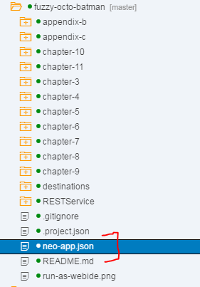

# SAPUI5 The Comprehensive Guide

#### written by Christiane Goebels, Denise Nepraunig, Thilo Seidel, Paul Modderman

This repository contains the source code for the [SAPUI5 Comprehensive Guide](https://www.sap-press.com/sapui5_4987/).

The examples are created with SAP Web IDE. When you want to run a specific example, right click the html file and choose **"Run -> Run as Web Application"**.

Please make sure that the **neo-app.json** file is in the root folder of your project!

[@denisenepraunig - Denise Nepraunig](https://twitter.com/denisenepraunig)

[@learnui5 - Christiane Goebels](https://twitter.com/learnui5)

[@ThiloDev - Thilo Seidel](https://twitter.com/ThiloDev)

[@PaulModderman - Paul Modderman](https://twitter.com/PaulModderman)